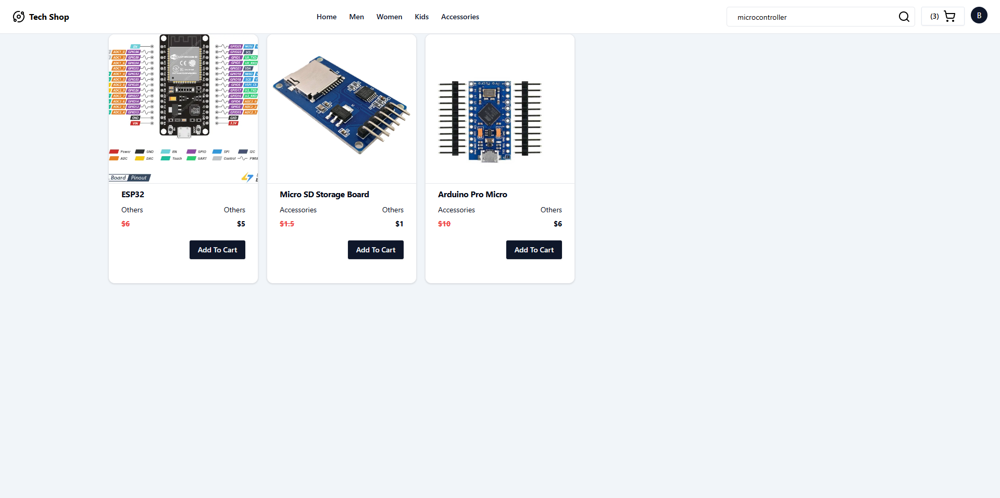

  

    <h1>MERN E-Commerce application.</h1>
    

      
      
      
      
      
    

    

      Build a Ecommerce application with admin panel using MERN Stack.
    

  

  

	<h1>Home Page</h1>
    
  

  
  

	<h1>Products Section with filtering</h1>
    
  

  

	<h1>Product</h1>
    
  

  

	<h1>Single Product page</h1>
    
  

  

	<h1>Search funtion</h1>
    
  

  

	<h1>Cart section</h1>
    
  

  
  

	<h1>Address book</h1>
    
  

  
  

	<h1>Order section</h1>
    
  

  

	<h1>Sand box to payment paypal</h1>
    
  

  

	<h1>Orders</h1>
    
  

  

	<h1>Poroduct lists for admin</h1>
    
  

  

	<h1>Add new Product</h1>
    
  

  

	<h1>Update Product</h1>
    
  

  

	<h1>Maintain uploaded files delete or add new file</h1>
    
  

  

	<h1>Order Status</h1>
    
  

  

